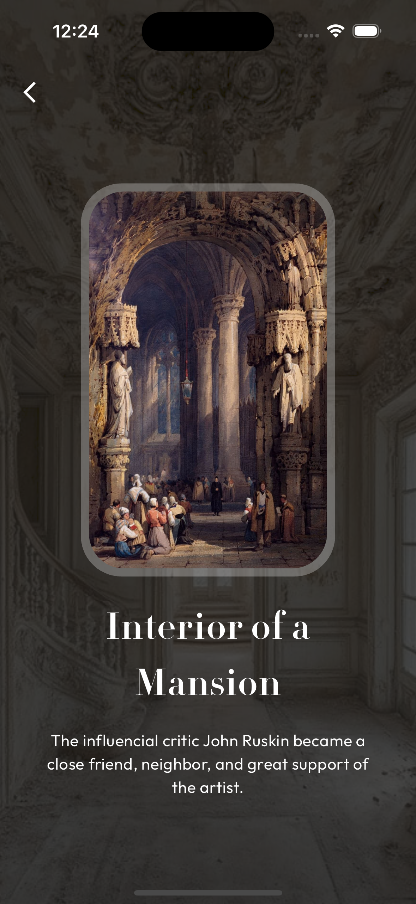

# Virtual Exhibition App

An immersive virtual exhibition experience built with Flutter. This app allows users to explore various exhibits, view detailed information, and enjoy interactive features.

## Features

- **Browse Exhibits**: Explore different virtual exhibits with a visually appealing UI.
- **Exhibit Details**: View detailed information about each exhibit, including descriptions and images.
- **Interactive UI**: Smooth navigation and engaging user interactions with animations.
- **Categories**: Exhibits are categorized for easy browsing and discovery.
- **Responsive Design**: Optimized layout for both mobile and tablet screens.

## Project Structure

- **lib/models/**: Data models for categories and tiles for the exhibits.
- **lib/resources/**: Resources related to app assets, colors, and typography.
- **lib/routes/**: Handles navigation and page transitions within the app.
- **lib/utils/**: Utility files for managing the app's state.
- **lib/views/**: UI screens for the app, such as the home screen, onboarding, and exhibit details.
  - **lib/views/[screen_name]/widgets/**: Screen-specific custom widgets for modularity and reusability.

<!--
## Key Components

### Firebase Services

- **FirebaseAuthService**: Handles user authentication and OTP verification
- **FirestoreService**: Manages Firestore database operations
- **AccountService**: Manages banking accounts
- **TransactionService**: Handles money transfers between accounts

### Security Features

- **Two-Factor Authentication**: OTP verification for sensitive operations
- **Data Validation**: Server-side and client-side validation
- **Batch Operations**: Atomic transactions for money transfers
- **Secure Routing**: Authentication-based navigation
-->

To run this app:

1. Run `flutter pub get` to install dependencies
2. Run `flutter run` to start the app

## Screenshots

Here are some screenshots of the application:

| Splash Screen                                          | Home Screen                            | Detail Screen                                         |
| -------------------------------------------------- | ---------------------------------------------- | -------------------------------------------- |
|  |  |  |

| Exhibition Screen                                        | Cover Screen                                        
| ---------------------------------------------------- | ----------------------------------------------------- 
|  |  |

## LinkedIn Post:
https://www.linkedin.com/feed/update/urn:li:activity:7314567307198967808/

### Preview:

  <video src="https://github.com/user-attachments/assets/9997414d-d159-4dd5-b137-c8aae00a9717" width=100/>

